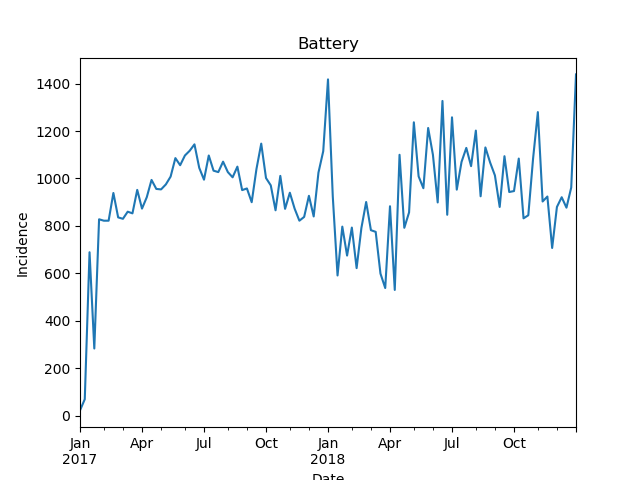
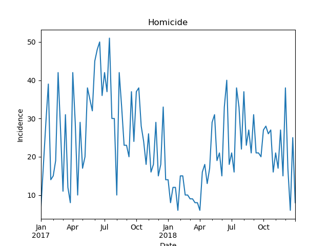

# Crime in Chicago
**Assignment no. 1: Diagnostic**

## Getting started

This program requires:
* python 3.7.3
* geopandas 0.4.1
* matplotlib 3.0.3
* numpy 1.16.2
* pandas 0.24.2
* shapely 1.6.4
* tabulate 0.8.3
* any dependencies

From the command line, run:

```
$ python chicago_crime.py <year_min> <year_max> <crime_list> <k_most> <demo>
```

* **year_min**: inclusive upper bound year
* **year_max**: inclusive lower bound year
* **crime_list**: comma-delimited list of crimes
* **k_most**: number of highest-incidence blocks to report
* **demo**: whether to run in demo mode from existing CSV files

The program shows the analysis detailed below, and creates some files:
* chicago-block-groups.csv
* chicago-crime.csv
* cook-county-acs5-2017.csv
* graphs from any crimes in `<crime_list>` as .png

This data may take some time to download and compile. To rerun the program, you may tell the program to reference the files it generated in a previous run by changing the last positional argument in the function call to `True`.

The example here calls:

```
$ python chicago_crime.py 2017 2018 battery, homicide, deceptive practice, sex offense 3 False
```

## Summary statistics

#### Criminal incidents overall

```
year          incidents
------  ---------------
2017    263830
2018    261616
change      -0.00839177
```

#### Criminal incidents by change year-to-year

```
primary_type                         2017    2018       change
---------------------------------  ------  ------  -----------
NON-CRIMINAL (SUBJECT SPECIFIED)        1       3   2
HUMAN TRAFFICKING                       8      15   0.875
CONCEALED CARRY LICENSE VIOLATION      71     133   0.873239
PUBLIC INDECENCY                        8      13   0.625
LIQUOR LAW VIOLATION                  191     262   0.371728
INTERFERENCE WITH PUBLIC OFFICER     1081    1279   0.183164
WEAPONS VIOLATION                    4672    5405   0.156892
NARCOTICS                           11350   12640   0.113656
ASSAULT                             19112   20327   0.0635726
SEX OFFENSE                           979    1040   0.0623085
INTIMIDATION                          153     162   0.0588235
CRIM SEXUAL ASSAULT                  1614    1665   0.0315985
GAMBLING                              190     194   0.0210526
CRIMINAL TRESPASS                    6713    6831   0.0175778
OFFENSE INVOLVING CHILDREN           2178    2214   0.0165289
OBSCENITY                              85      86   0.0117647
BATTERY                             48646   49161   0.0105867
OTHER OFFENSE                       16728   16869   0.00842898
STALKING                              188     189   0.00531915
NON-CRIMINAL                           36      36   0
THEFT                               63347   63132  -0.003394
DECEPTIVE PRACTICE                  17955   17770  -0.0103035
CRIMINAL DAMAGE                     28504   27397  -0.0388367
PUBLIC PEACE VIOLATION               1471    1359  -0.0761387
BURGLARY                            12832   11554  -0.0995948
MOTOR VEHICLE THEFT                 11225    9968  -0.111982
PROSTITUTION                          707     627  -0.113154
ARSON                                 426     373  -0.124413
KIDNAPPING                            193     167  -0.134715
ROBBERY                             11728    9711  -0.171982
HOMICIDE                             1427    1033  -0.276104
OTHER NARCOTIC VIOLATION               11       1  -0.909091
```

#### Community areas by change year-to-year in criminal incidents

```
community                 2017    2018        change
----------------------  ------  ------  ------------
HYDE PARK                 1688    1884   0.116114
LINCOLN PARK              4378    4883   0.115349
GARFIELD RIDGE            1888    2066   0.0942797
PULLMAN                   1087    1176   0.0818767
EDGEWATER                 2581    2752   0.0662534
BURNSIDE                   361     383   0.0609418
WEST GARFIELD PARK        5278    5597   0.0604396
EAST GARFIELD PARK        4669    4950   0.0601842
CALUMET HEIGHTS           1308    1380   0.0550459
ENGLEWOOD                 5877    6157   0.0476434
JEFFERSON PARK            1034    1082   0.0464217
NEAR NORTH SIDE          12173   12736   0.0462499
CLEARING                   851     889   0.0446533
DOUGLAS                   2541    2653   0.0440771
NORWOOD PARK              1050    1096   0.0438095
WASHINGTON HEIGHTS        3061    3167   0.0346292
NEAR WEST SIDE            8966    9228   0.0292215
MORGAN PARK               2069    2124   0.0265829
LAKE VIEW                 5635    5784   0.0264419
CHATHAM                   6351    6515   0.0258227
WEST ELSDON                999    1023   0.024024
RIVERDALE                 1323    1354   0.0234316
DUNNING                   1468    1495   0.0183924
WEST ENGLEWOOD            6890    7015   0.0181422
NORTH LAWNDALE            8921    9074   0.0171505
WASHINGTON PARK           2735    2771   0.0131627
NORTH PARK                 939     950   0.0117146
WEST PULLMAN              3948    3981   0.00835866
LOOP                     10530   10606   0.00721747
BEVERLY                    865     870   0.00578035
ARCHER HEIGHTS             828     832   0.00483092
MONTCLARE                  590     592   0.00338983
UPTOWN                    3541    3547   0.00169444
ASHBURN                   2335    2334  -0.000428266
GREATER GRAND CROSSING    6396    6389  -0.00109443
ROSELAND                  6853    6835  -0.00262659
SOUTH LAWNDALE            4504    4485  -0.00421847
HUMBOLDT PARK             7999    7932  -0.00837605
ARMOUR SQUARE              993     982  -0.0110775
AVONDALE                  2293    2264  -0.0126472
BRIDGEPORT                1484    1463  -0.0141509
SOUTH SHORE               8638    8501  -0.0158602
AUBURN GRESHAM            7407    7267  -0.018901
SOUTH DEERING             1722    1689  -0.0191638
WEST RIDGE                3463    3381  -0.0236789
CHICAGO LAWN              5699    5549  -0.0263204
AUSTIN                   15034   14633  -0.0266729
LOGAN SQUARE              4920    4778  -0.0288618
BELMONT CRAGIN            4545    4411  -0.0294829
LINCOLN SQUARE            1970    1902  -0.0345178
ALBANY PARK               2425    2340  -0.0350515
PORTAGE PARK              3308    3192  -0.0350665
BRIGHTON PARK             2228    2138  -0.040395
SOUTH CHICAGO             4516    4326  -0.0420726
KENWOOD                   1494    1431  -0.0421687
HERMOSA                   1483    1413  -0.0472016
EDISON PARK                251     239  -0.0478088
WEST LAWN                 1847    1755  -0.0498105
NEAR SOUTH SIDE           1918    1812  -0.0552659
GRAND BOULEVARD           3419    3206  -0.0622989
FULLER PARK                896     836  -0.0669643
IRVING PARK               2951    2745  -0.0698068
OAKLAND                    673     626  -0.0698366
OHARE                     1589    1476  -0.0711139
AVALON PARK               1269    1178  -0.07171
NORTH CENTER              1410    1305  -0.0744681
HEGEWISCH                  650     601  -0.0753846
LOWER WEST SIDE           2575    2351  -0.0869903
ROGERS PARK               4065    3697  -0.0905289
GAGE PARK                 2258    2044  -0.0947741
FOREST GLEN                534     482  -0.0973783
EAST SIDE                 1201    1073  -0.106578
MOUNT GREENWOOD            544     485  -0.108456
WOODLAWN                  3814    3397  -0.109334
NEW CITY                  4605    4095  -0.110749
WEST TOWN                 8197    7076  -0.136757
MCKINLEY PARK             1032     890  -0.137597
```

## Descriptive statistics

1. **What type of blocks have reports of battery?** These incidents seem to occur in both majority white well-educated blocks and majority-black less-educated blocks. The graph suggests a large increase in reports at the end of the calendar year.

```
#### BATTERY


Loop, block no. 170318391001:

    Ranked no. 1 for most CPD responses to incidents of battery in 2018:
    2018: 322.0
    2017: 289.0

    Groups most represented in ACS statistics for this block:
    race_white: 53.7%
    educ_bachelors: 45.34%
    hhinc_00_10K: 14.26%


Greater Grand Crossing, block no. 170314207005:

    Ranked no. 2 for most CPD responses to incidents of battery in 2018:
    2018: 175.0
    2017: 189.0

    Groups most represented in ACS statistics for this block:
    race_black: 92.42%
    educ_highschool: 31.23%
    hhinc_00_10K: 31.78%


Woodlawn, block no. 170314207005:

    Ranked no. 3 for most CPD responses to incidents of battery in 2018:
    2018: 175.0
    2017: 189.0

    Groups most represented in ACS statistics for this block:
    race_black: 92.42%
    educ_highschool: 31.23%
    hhinc_00_10K: 31.78%
```



2. **What type of blocks have reports of homicide?** These incidents seem to occur in majority-black, less-educated, low-income blocks. The graph suggests a sustained increased in reports during the summer months, but that 2018 was less violent than 2017.

```
#### HOMICIDE


Riverdale, block no. 170315401022:

    Ranked no. 1 for most CPD responses to incidents of homicide in 2018:
    2018: 13.0
    2017: nan

    Groups most represented in ACS statistics for this block:
    race_black: 90.55%
    educ_highschool: 26.0%
    hhinc_00_10K: 30.89%


West Garfield Park, block no. 170312604001:

    Ranked no. 2 for most CPD responses to incidents of homicide in 2018:
    2018: 11.0
    2017: nan

    Groups most represented in ACS statistics for this block:
    race_black: 97.99%
    educ_highschool: 27.62%
    hhinc_00_10K: 30.98%


South Lawndale, block no. 170318434001:

    Ranked no. 3 for most CPD responses to incidents of homicide in 2018:
    2018: 11.0
    2017: 9.0

    Groups most represented in ACS statistics for this block:
    race_black: 67.7%
    educ_highschool: 29.52%
    hhinc_20_25K: 13.9%
```



3. **What type of blocks have reports of deceptive practice?** These incidents seem to occur in majority white well-educated blocks. The graph suggests incidents remain fairly consistent throughout the calendar year, save for an isolated increase at the end of 2017.

```
#### DECEPTIVE PRACTICE


Loop, block no. 170318391001:

    Ranked no. 1 for most CPD responses to incidents of deceptive practice in 2018:
    2018: 675.0
    2017: 578.0

    Groups most represented in ACS statistics for this block:
    race_white: 53.7%
    educ_bachelors: 45.34%
    hhinc_00_10K: 14.26%


Loop, block no. 170313204001:

    Ranked no. 2 for most CPD responses to incidents of deceptive practice in 2018:
    2018: 265.0
    2017: 207.0

    Groups most represented in ACS statistics for this block:
    race_white: 64.16%
    educ_masters: 34.8%
    hhinc_150_200K: 11.21%


Near North Side, block no. 170310812012:

    Ranked no. 3 for most CPD responses to incidents of deceptive practice in 2018:
    2018: 212.0
    2017: 190.0

    Groups most represented in ACS statistics for this block:
    race_white: 78.35%
    educ_bachelors: 44.06%
    hhinc_50_60K: 21.21%
```


4. **What type of blocks have reports of sex offense?** These incidents seem to occur in both majority white, well-educated, high-income blocks and majority-black, well-educated, low-income blocks. The graph suggests incidents remain fairly consistent with the average despite swings week-to-week, but also that incidents increase during major holiday seasons.

```
Loop, block no. 170313204001:

    Ranked no. 1 for most CPD responses to incidents of sex offense in 2018:
    2018: 10.0
    2017: 6.0

    Groups most represented in ACS statistics for this block:
    race_white: 64.16%
    educ_masters: 34.8%
    hhinc_150_200K: 11.21%


East Garfield Park, block no. 170318378001:

    Ranked no. 2 for most CPD responses to incidents of sex offense in 2018:
    2018: 8.0
    2017: nan

    Groups most represented in ACS statistics for this block:
    race_black: 59.76%
    educ_bachelors: 29.4%
    hhinc_00_10K: 18.62%


Loop, block no. 170313201002:

    Ranked no. 3 for most CPD responses to incidents of sex offense in 2018:
    2018: 8.0
    2017: 2.0

    Groups most represented in ACS statistics for this block:
    race_white: 68.68%
    educ_bachelors: 52.4%
    hhinc_75_100K: 16.84%
```


## Refuting Jacob Ringer

1. **Are the crime statistics presented by the Jacob Ringer campaign correct?** The data does not support the campaign's claims with respect to crime city-wide. Crime overall is down 1.8%, and robberies, battery, burglaries, and motor vehicle theft incidents in particular during the month of June declined from 2017 to 2018. His campaign describes an opposite characterization of crime in Chicago.

#### Criminal incidents in June overall

```
year        incidents
------  -------------
2017    23692
2018    23243
change     -0.0189515
```

#### Criminal incidents in June by change year-to-year 

```
primary_type                         2017    2018        change
---------------------------------  ------  ------  ------------
CONCEALED CARRY LICENSE VIOLATION       3      14   3.66667
LIQUOR LAW VIOLATION                   18      27   0.5
NARCOTICS                             866    1047   0.209007
CRIM SEXUAL ASSAULT                   123     143   0.162602
GAMBLING                               30      34   0.133333
PUBLIC PEACE VIOLATION                127     142   0.11811
STALKING                               14      15   0.0714286
OTHER OFFENSE                        1394    1484   0.0645624
DECEPTIVE PRACTICE                   1489    1576   0.0584285
WEAPONS VIOLATION                     439     464   0.0569476
INTERFERENCE WITH PUBLIC OFFICER      100     105   0.05
THEFT                                5691    5695   0.000702864
KIDNAPPING                             18      18   0
HUMAN TRAFFICKING                       1       0   0
PUBLIC INDECENCY                        0       2   0
ASSAULT                              1872    1861  -0.00587607
CRIMINAL DAMAGE                      2566    2493  -0.0284489
BATTERY                              4637    4459  -0.0383869
BURGLARY                             1095    1027  -0.0621005
INTIMIDATION                           15      14  -0.0666667
OFFENSE INVOLVING CHILDREN            176     163  -0.0738636
SEX OFFENSE                            88      81  -0.0795455
CRIMINAL TRESPASS                     610     555  -0.0901639
ROBBERY                               984     846  -0.140244
MOTOR VEHICLE THEFT                  1003     768  -0.234297
PROSTITUTION                           77      58  -0.246753
ARSON                                  46      29  -0.369565
HOMICIDE                              198     117  -0.409091
OBSCENITY                               6       3  -0.5
NON-CRIMINAL                            6       3  -0.5
```

## Advising Mayor-elect Lori Lightfoot

1. Crime exists throughout the city, but the type of its manifestation varies across neighborhoods. The mayor-elect should distinguish reporting between violent and non-violent crime without minimizing the persistence of any crime throughout the city.

2. Violent crime appears in majority black neighborhoods. The mayor-elect should consider and address the underlying circumstances that escalate to incidents of violence in black communities.

3. The types of crimes reported are broad, and may not characterize the severity of the incident. The mayor-elect should consider implementing a severity scale to accompany police reporting. The subjectivity of such a scale might offer a lighter interpretation of the prevalence of crime and reveal communities that are over- or under-policed.

4. The data does not indicate whether CPD response deescalates an incident when there is no arrest. The mayor-elect should consider data collection measures that allows her office to evaluate where and how the CPD successfully resolves conflict, which might indicate its commitment to community policing.

5. The data reports large changes in the incidence of narcotics, motor vehicle theft, prostitution, arson, and homicide. The mayor-elect should verify whether these are the consequence of shifting CPD priorities or change in criminal behavioral controlling for measures of deterrence.

This analysis has its limitations, particularly in that it does not distinguish criminal incidents by whether it resulted in an arrest, which may result in inflated statistics. The data is also limited in that it only records criminal instances for which CPD intervened, which may result in biased statistics because missingness at random is not plausible here.

## Probability of criminal incident

#### Probability of type of crime at 2111 S. Michigan Avenue

Theft is the most likely crime to occur at this address.

```
primary_type                        incidents    probability
--------------------------------  -----------  -------------
THEFT                                     241     0.316273
BATTERY                                   133     0.174541
DECEPTIVE PRACTICE                         73     0.0958005
CRIMINAL DAMAGE                            71     0.0931759
OTHER OFFENSE                              64     0.0839895
ASSAULT                                    40     0.0524934
ROBBERY                                    30     0.0393701
CRIMINAL TRESPASS                          29     0.0380577
MOTOR VEHICLE THEFT                        23     0.0301837
BURGLARY                                   18     0.023622
SEX OFFENSE                                10     0.0131234
OFFENSE INVOLVING CHILDREN                  7     0.00918635
CRIM SEXUAL ASSAULT                         6     0.00787402
NARCOTICS                                   4     0.00524934
PUBLIC PEACE VIOLATION                      3     0.00393701
WEAPONS VIOLATION                           3     0.00393701
OBSCENITY                                   2     0.00262467
INTIMIDATION                                2     0.00262467
ARSON                                       2     0.00262467
INTERFERENCE WITH PUBLIC OFFICER            1     0.00131234
```

#### Probability for theft in a community

An incidence of theft is more likely in Uptown (1.52%) than in East Garfield Park (0.99%), a difference of 0.53 percentage points.

```
community                 incidents    probability
----------------------  -----------  -------------
NEAR NORTH SIDE               11801    0.093304
LOOP                          11424    0.0903233
NEAR WEST SIDE                 6787    0.0536611
WEST TOWN                      5681    0.0449165
LINCOLN PARK                   4597    0.036346
LAKE VIEW                      4463    0.0352865
AUSTIN                         4298    0.0339819
LOGAN SQUARE                   3405    0.0269215
CHATHAM                        3051    0.0241226
SOUTH SHORE                    2805    0.0221776
AUBURN GRESHAM                 2337    0.0184774
HUMBOLDT PARK                  2201    0.0174021
ROGERS PARK                    2193    0.0173388
ROSELAND                       1988    0.015718
WEST ENGLEWOOD                 1986    0.0157022
UPTOWN                         1922    0.0151962
GREATER GRAND CROSSING         1899    0.0150144
NORTH LAWNDALE                 1891    0.0149511
CHICAGO LAWN                   1828    0.014453
EDGEWATER                      1710    0.01352
BELMONT CRAGIN                 1679    0.0132749
ENGLEWOOD                      1671    0.0132117
WEST RIDGE                     1636    0.012935
NEW CITY                       1597    0.0126266
SOUTH LAWNDALE                 1596    0.0126187
PORTAGE PARK                   1593    0.012595
IRVING PARK                    1527    0.0120732
DOUGLAS                        1379    0.010903
SOUTH CHICAGO                  1278    0.0101044
AVONDALE                       1274    0.0100728
EAST GARFIELD PARK             1255    0.0099226
GRAND BOULEVARD                1234    0.00975656
HYDE PARK                      1234    0.00975656
WASHINGTON HEIGHTS             1231    0.00973284
ALBANY PARK                    1212    0.00958262
WEST GARFIELD PARK             1209    0.0095589
LINCOLN SQUARE                 1170    0.00925055
NEAR SOUTH SIDE                1141    0.00902126
WOODLAWN                       1136    0.00898173
WEST PULLMAN                   1112    0.00879197
LOWER WEST SIDE                1055    0.00834131
NORTH CENTER                   1039    0.0082148
OHARE                          1015    0.00802505
MORGAN PARK                     984    0.00777995
WEST LAWN                       977    0.0077246
ASHBURN                         894    0.00706837
GARFIELD RIDGE                  892    0.00705255
WASHINGTON PARK                 857    0.00677583
GAGE PARK                       818    0.00646748
SOUTH DEERING                   808    0.00638841
KENWOOD                         762    0.00602472
BRIGHTON PARK                   685    0.00541592
BRIDGEPORT                      660    0.00521826
DUNNING                         607    0.00479922
NORTH PARK                      594    0.00469643
PULLMAN                         579    0.00457784
HERMOSA                         571    0.00451458
ARMOUR SQUARE                   570    0.00450668
JEFFERSON PARK                  555    0.00438808
NORWOOD PARK                    527    0.0041667
WEST ELSDON                     507    0.00400857
BEVERLY                         467    0.00369231
MCKINLEY PARK                   462    0.00365278
CALUMET HEIGHTS                 459    0.00362906
AVALON PARK                     445    0.00351837
FULLER PARK                     377    0.00298073
ARCHER HEIGHTS                  360    0.00284632
CLEARING                        359    0.00283842
EAST SIDE                       335    0.00264866
FOREST GLEN                     310    0.002451
RIVERDALE                       304    0.00240356
MOUNT GREENWOOD                 286    0.00226124
OAKLAND                         266    0.00210312
HEGEWISCH                       234    0.00185011
MONTCLARE                       227    0.00179476
BURNSIDE                        101    0.000798552
EDISON PARK                     100    0.000790645
```

#### Bayes' theorem

There are a total of 1000 calls, 600 from Garfield Park and 400 from Uptown. Of the 600 calls from Garfield Park, 100 of them are about battery. Of the 400 calls from Uptown, 160 are about battery. Therefore:

* P(Garfield Park) = 600 / 1000 = 0.6000
* P(Uptown) = 400 / 1000 = 0.4000

* P(battery) = (100 + 400) / 1000 = 0.5000
* P(battery | Garfield Park) = 100 / 600 = 0.1667
* P(battery | Uptown) = 160 / 400 = 0.4000

* P(Garfield Park | battery) = P(Garfield Park) * P(battery | Garfield Park) / P(battery) = 0.6000 * 0.1667 / 0.5000 = 0.2000
* P(Uptown | battery) = P(Uptown) * P(battery | Uptown) / P(battery) = 0.4000 * 0.4000 / 0.5000 = 0.3200

It is 12% less likely that a call about battery comes from Garfield Park than from Uptown.

