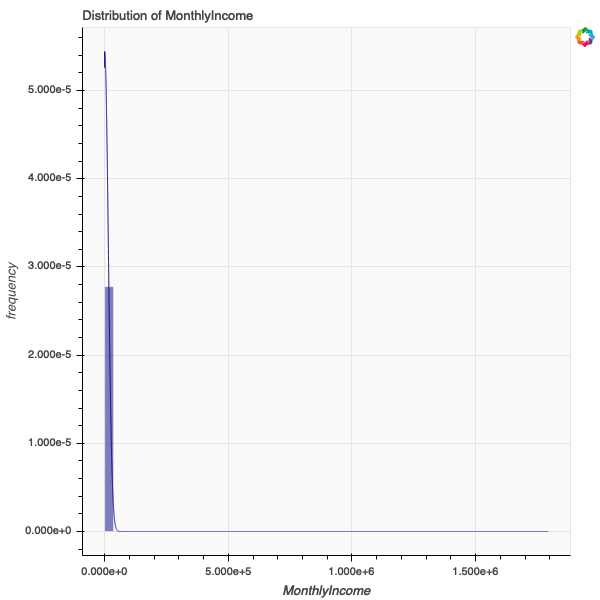
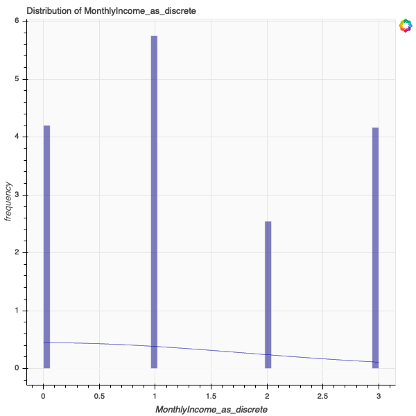
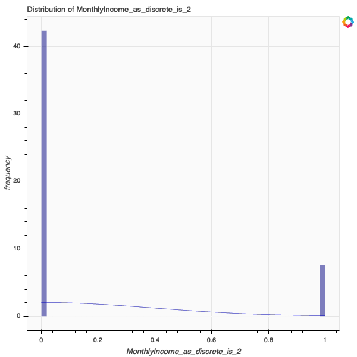

# Plumbum
**Assignment no. 2: Machine Learning Pipeline**

## Getting started

Plumbum is a simple machine learning pipeline library to:
* read data from a CSV file
* clean and pre-process data
* explore data
* create features from data
* create a decision tree classifier from data

Before we begin, please note this library requires:
* python 3.7.3
* bokeh 1.1.0
* numpy 1.16.2
* pandas 0.24.2
* phantomjs 2.1.1
* pillow 6.0.0
* selenium 3.141.0
* any dependencies

## Creating a Plumbum object

Import Plumbum into your workspace:

```
from pld_learn import Plumbum as pb

credit = pb("credit-data.csv", "credit-data-descriptions.csv")
```

Initialize a Plumbum object with up to two parameters:
* **dataset_path**: path to CSV file of dataset as string
* **definitions_path**: path to CSV file of variable descriptions as string (optional, default=None)
* **seed**: random seed (optional, default=0)

Plumbum performs several operations upon initialization:
* **_clean_numeric_nas**: identify numeric variables and replace NA values with variable median
* **_clean_string_whitespace**: identify variable names and string variables and remove leading and trailing whitespace
* **_summarize_feature**: calculate summary statistics and include a description of each variable, if provided

## Explore data

The Plumbum object maintains metadata for each variable, as well as helpful documentation of new features and classifiers. The list of available metadata is in the object representation:

```
credit

## Available metadata:
##     PersonID
##     SeriousDlqin2yrs
##     RevolvingUtilizationOfUnsecuredLines
##     age
##     zipcode
##     NumberOfTime30-59DaysPastDueNotWorse
##     DebtRatio
##     MonthlyIncome
##     NumberOfOpenCreditLinesAndLoans
##     NumberOfTimes90DaysLate
##     NumberRealEstateLoansOrLines
##     NumberOfTime60-89DaysPastDueNotWorse
##     NumberOfDependents
```

Request and assign metadata for access from outside the object. Invoke the `.request()` method with:
* a string or list of strings representing valid metadata keys
* no parameters to return all Plumbum object metadata

```
MonthlyIncome = credit.request("MonthlyIncome")
MonthlyIncome.keys()

## dict_keys(['summary', 'definition'])

pd.Series(MonthlyIncome["summary"])

## count    4.101600e+04
## mean     6.320623e+03
## std      1.208056e+04
## min      0.000000e+00
## 25%      3.800000e+03
## 50%      5.250000e+03
## 75%      7.245500e+03
## max      1.794060e+06
## Name: MonthlyIncome, dtype: float64
```

The metadata key `MonthlyIncome` is a variable name, so this request exports a PNG of the variable distribution to the present working directory:



## Discretize continuous variables

The `.as_discrete()` methods takes two parameters:
* **variable_name**: a string representing a valid variable name
* **bins**: an integer representing the number of quantiles by which to discretize the variable

Plumbum creates a new discretized variable with the name "variable_name_as_discrete", and updates the metadata to include a mapping quantiles.

```
credit.as_discrete("MonthlyIncome", 4)
MonthlyIncome_as_discrete = credit.request("MonthlyIncome_as_discrete")
pd.Series(MonthlyIncome_as_discrete["quantiles"])

## 0          (0.0, 3800.0]
## 1       (3800.0, 5250.0]
## 2       (5250.0, 7245.5]
## 3    (7245.5, 1794060.0]
## dtype: object
```
The metadata key `MonthlyIncome_as_discrete` is now also a variable name, so this request exports a PNG of the variable distribution to the present working directory:



## Categorize discrete variables

The `.as_dummy()` methods takes one parameter:
* **variable_name**: a string representing a valid variable name

Plumbum creates new dummy variables with the name "variable_name_is_value" for each unique value, and updates the metadata to include a list of the new variables.

```
credit.as_dummy("MonthlyIncome_as_discrete")
MonthlyIncome_as_discrete = credit.request("MonthlyIncome_as_discrete")
pd.Series(MonthlyIncome_as_discrete["dummies"])

## 0    MonthlyIncome_as_discrete_is_0
## 1    MonthlyIncome_as_discrete_is_3
## 2    MonthlyIncome_as_discrete_is_1
## 3    MonthlyIncome_as_discrete_is_2
## dtype: object

MonthlyIncome_as_discrete_is_2 = credit.request("MonthlyIncome_as_discrete_is_2")
```



**Warning**: this method creates a dummy for **each** unique value in the variable. 

## Create and evaluate a decision tree classifier

The `.as_classifier()` methods takes up to two parameters:
* **variable_name**: a string representing a valid variable name by which to classify
* **test_size**: a float representing the proportion of the dataset to dedicate to testing (optional, default=0.3)

Plumbum performs several operations upon classification:
* create a simple scikit-learn `DecisionTreeClassifier()` object
* exports a PNG of the distribution of correct and incorrect classification
* updates the metadata to include the classifier object and an accuracy score

```
credit.as_classifier("SeriousDlqin2yrs")
SeriousDlqin2yrs = credit.request("SeriousDlqin2yrs")
SeriousDlqin2yrs.keys()

## dict_keys(['summary', 'definition', 'classifier_object', 'classifier_predictions', 'classifier_accuracy'])

SeriousDlqin2yrs["classifier"]

## DecisionTreeClassifier(class_weight=None, criterion='gini', max_depth=None,
##             max_features=None, max_leaf_nodes=None,
##             min_impurity_decrease=0.0, min_impurity_split=None,
##             min_samples_leaf=1, min_samples_split=2,
##             min_weight_fraction_leaf=0.0, presort=False, random_state=None,
##             splitter='best')

SeriousDlqin2yrs["accuracy"]

## 0.9166192604632263

```
